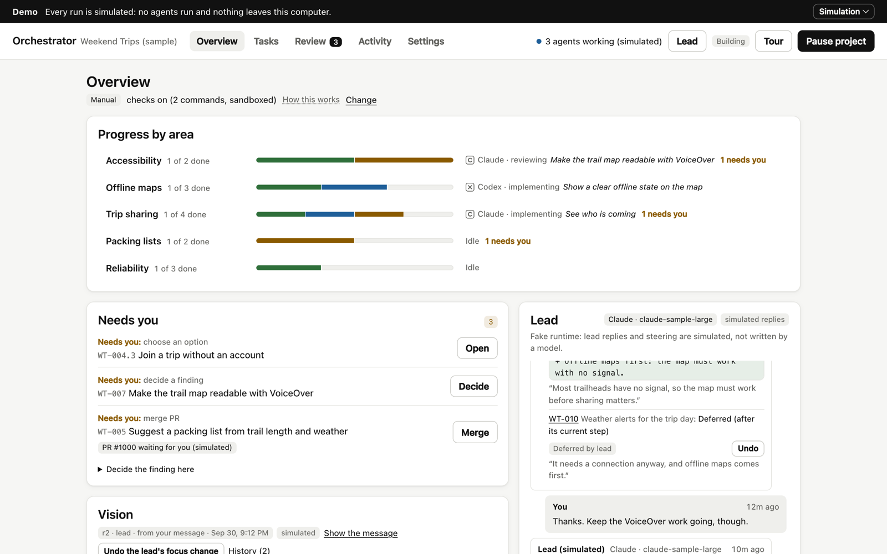
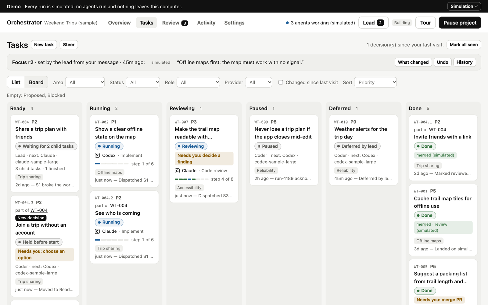

# Orchestrator


**One lead agent runs a team of Claude and Codex agents on your repository.** You set the vision and steer. The lead plans each task, picks a flow, and runs it step by step, handing each step only the artifacts it needs. You can read, edit or rerun any step, and you look at results instead of every detail.

## Try the demo

The demo needs no API keys and runs no agents, and nothing leaves your computer:

```bash
git clone https://github.com/erickb336/orchestrator.git
cd orchestrator
npm install
npm start
```

It opens a sample project on a simulated runtime, with a short tour. It needs Node.js 22.13 or newer.


## How it works

1. **Shape the vision with the lead.** It asks targeted questions and drafts the vision with you. Nothing runs yet.
2. **The lead plans tasks.** Each task gets a spec: the options, their trade-offs, and the chosen approach.
3. **It picks a flow for each task** (see below), and a provider and model for each step.
4. **Each step is a fresh agent** working in its own copy of the repository. Steps pass work on as artifacts: the design, the change, findings, check results, the verification. Each step also gets a few short working principles that fit its job (fix the root cause, the smallest change, prove it works), adapted from [pstack](https://github.com/cursor/plugins/tree/main/pstack) (MIT). Every agent and the lead also get one of our own, *contextualize and write for the reader*: whatever they write says where it fits in the project, what the problem and the decisions were, and what is left, so you can come in cold.
5. **The service runs your project's checks** (tests, lint, build). **Then a code review and a security review run side by side.** The coder repairs whatever any of them found, and they run again until all are clean.
6. **The lead verifies the result against the spec.** The work is then delivered as a branch or a pull request, which you merge or which merges automatically.
7. **You look at the results later,** whenever you like, and can send anything that landed back as a fix or a revert.

You can step in at any point:

- message the lead in plain language (every change it makes has an Undo);
- pause a task;
- edit an artifact;
- rerun a step.



### The six flows

| Flow | For | Steps |
| --- | --- | --- |
| **Change** | Most code changes | implement → checks → code review and security review side by side → repair until clean → final checks → the lead verifies |
| **Bug fix** | A defect you can reproduce | reproduce → then as Change; the lead confirms the bug is gone |
| **Feature** | New screens, flows or copy | design → implement → checks with a UX review beside them → code and security review → repair → final checks → verify |
| **Design** | Settling a design first | design → UX review → revise → the lead writes the implementation brief |
| **Investigation** | The cause is unknown | gather evidence → review it → the lead proposes a spec (no code) |
| **Goal** | Work too big for one task | the lead breaks it into child tasks that run in parallel, then evaluates and re-plans |

Each flow is a short JSON file in [`flows/`](flows/). To change one, edit its file and run `npm test`. The security review adds one review run per round.



## Why I built it

I use several AI agents every day, and the bottleneck is no longer writing code: it is me. I juggle chats, re-explain direction, check whether "the tests pass" is true, and read every diff. Orchestrator is my playground for changing that. The goal is to take myself out of the loop as much as possible, reviewing artifacts and working results instead of details.

It is deliberately small, local and readable, so that changing it is cheap. Fork it and make it yours.

**How it was made.**

- I set the direction and made the calls. AI agents in Claude Code wrote the specs and the code: a lead, plus designer, coder and reviewer agents.
- Every feature started as a versioned spec with options and trade-offs ([`docs/tasks/`](docs/tasks/)).
- Each implementation was reviewed by a separate agent, and every finding was fixed with a regression test.

## Use it on your own repository

```bash
npm run setup   # asks once: real agents or the demo, and how Claude and Codex sign in
npm start
```

**Signing in:**

- **Claude:** an Anthropic API key, cloud credentials, or (opt-in, for personal use) your own Claude subscription token. Read [the note on subscription tokens](docs/real-agents.md#your-own-claude-subscription-token) before using one.
- **Codex:** your ChatGPT sign-in.
- **Your keys never pass through Orchestrator.** They stay in your Keychain or your environment.

Details: [docs/real-agents.md](docs/real-agents.md).

## Safety in brief

- **Local only.** The service runs on your computer and listens on 127.0.0.1 only.
- **Isolated worktrees.** Every agent works in its own git worktree. Your branch changes only by a fast-forward of verified work, or through a pull request.
- **Sandboxed agents.** Codex workers run in Codex's sandbox. Claude workers have no shell unless you turn one on.
- **Sandboxed checks.** Your project's checks run in a sandbox with no network, except dependency installs, which run with every install hook off.
- **Narrow GitHub use.** On GitHub the app only ever merges the exact commit that was verified. It never force-pushes or uses admin rights.

Full notes: [docs/safety.md](docs/safety.md).

## Development

```bash
npm run dev        # service + UI at http://127.0.0.1:5317, restarting on change
npm run typecheck
npm test
npm run build
npm run capture    # retake the README images from the demo (needs Chrome and ffmpeg)
```

**Where things are:**

- `src/domain/`: pure state and commands, no I/O.
- `server/`: the SQLite store, the scheduler, the Claude and Codex adapters, git worktrees, and the HTTP API.
- `src/ui/`: the React app.
- `flows/`: the flows.
- `docs/tasks/`: one spec per feature.

## Status

This is a personal tool under active development. It was built in milestones, each with a spec and an independent review; the latest is ORC-024.

**Recent:**

- [ORC-022](docs/tasks/ORC-022.md): the lead can send a note to an agent while its step runs, so you can change course without stopping the work. Note delivery to real models is unverified.
- [ORC-024](docs/tasks/ORC-024.md): the working principles above.

**Next:** a pass over the UI to simplify it. [ORC-023](docs/tasks/ORC-023.md), talking to the lead from Claude Code, is planned.

**Not yet verified with real models.** Every feature is tested against simulated and scripted Claude and Codex runtimes. Runs with real models still need checking: `node scripts/real-run-test.mjs` does it with your credentials.

## License

MIT. See [LICENSE](LICENSE).
