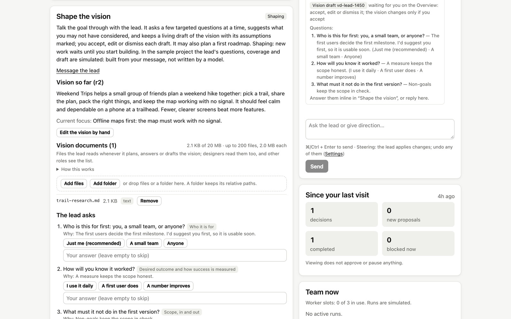
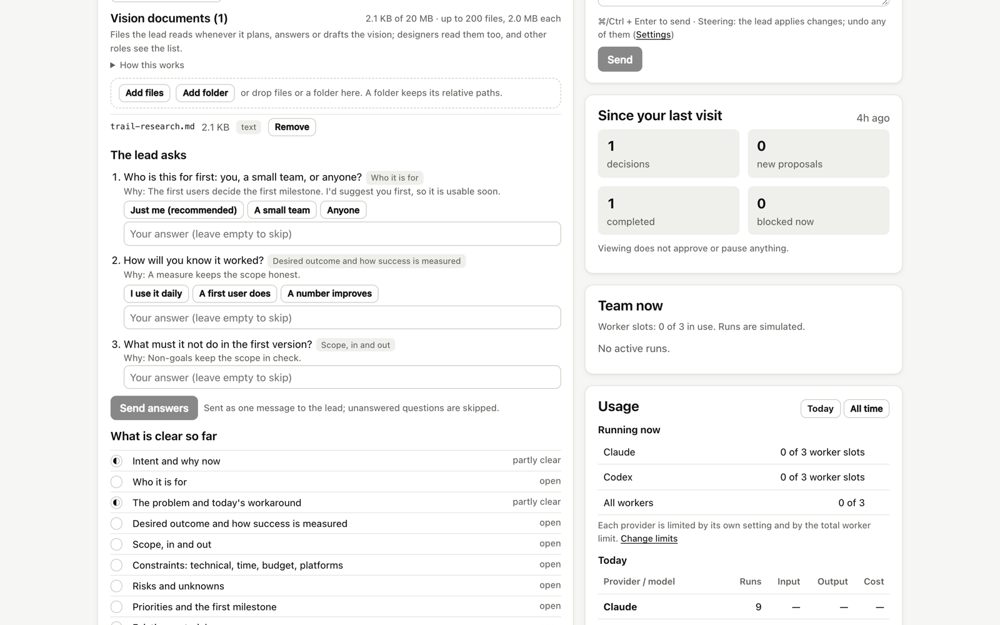
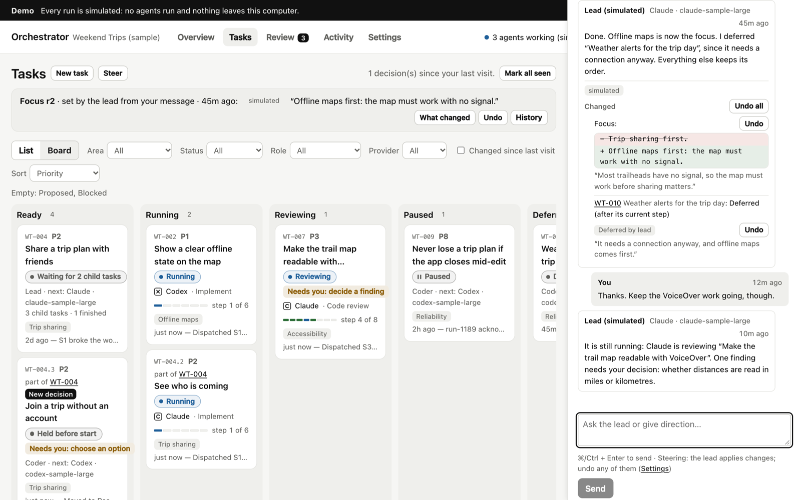
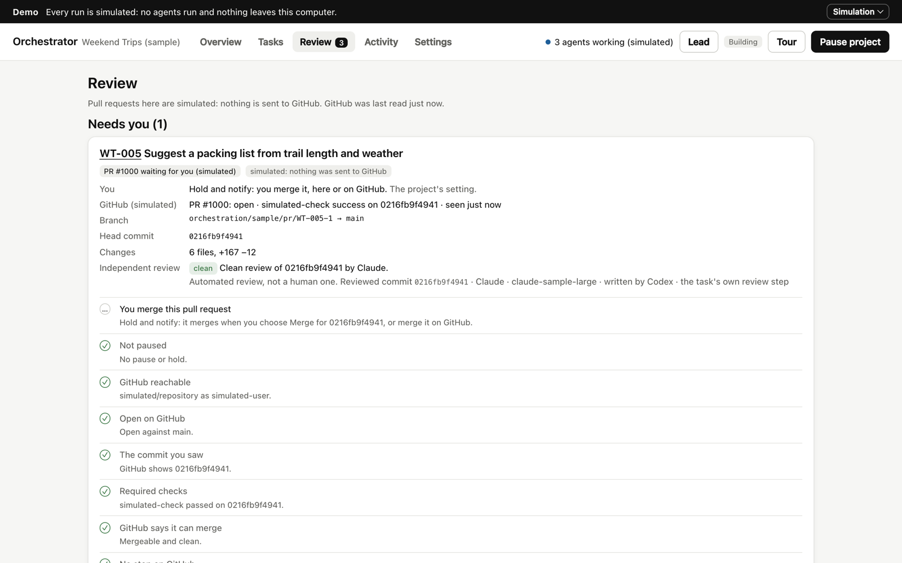
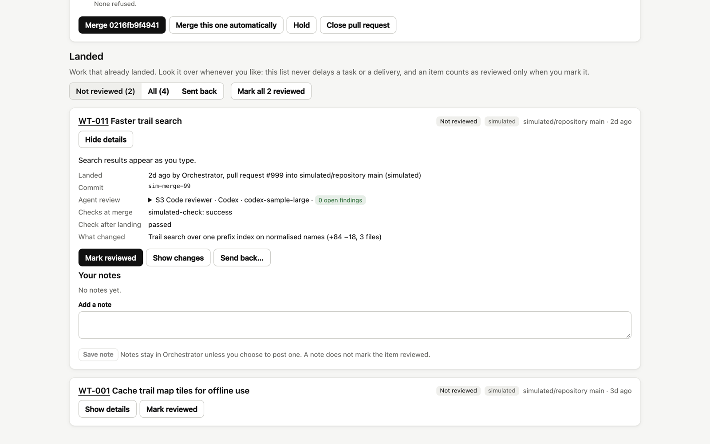
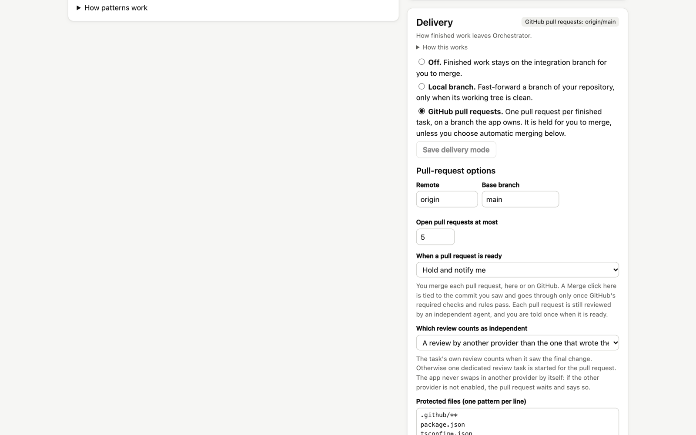
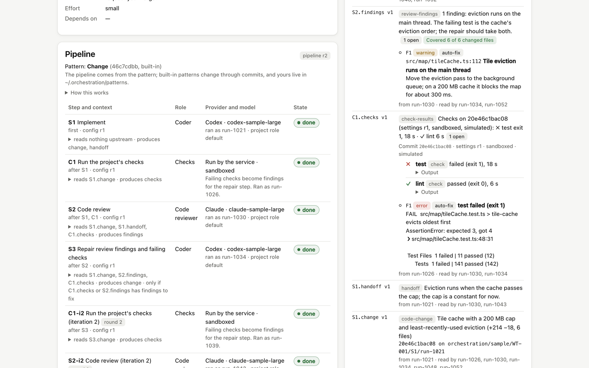
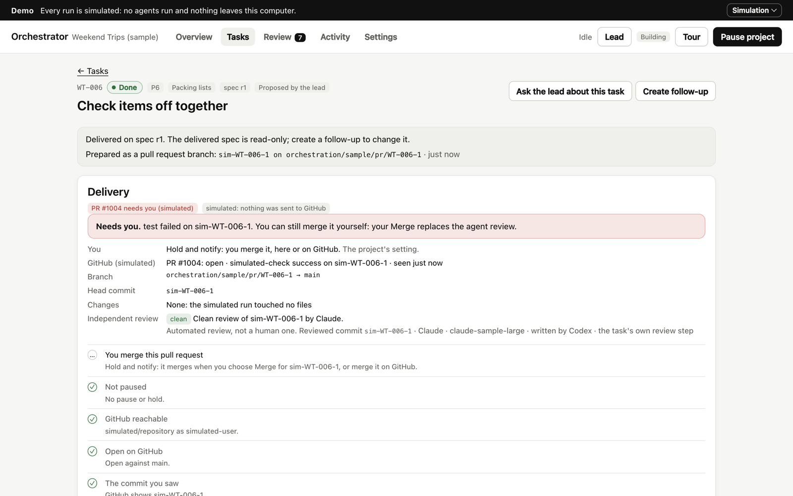
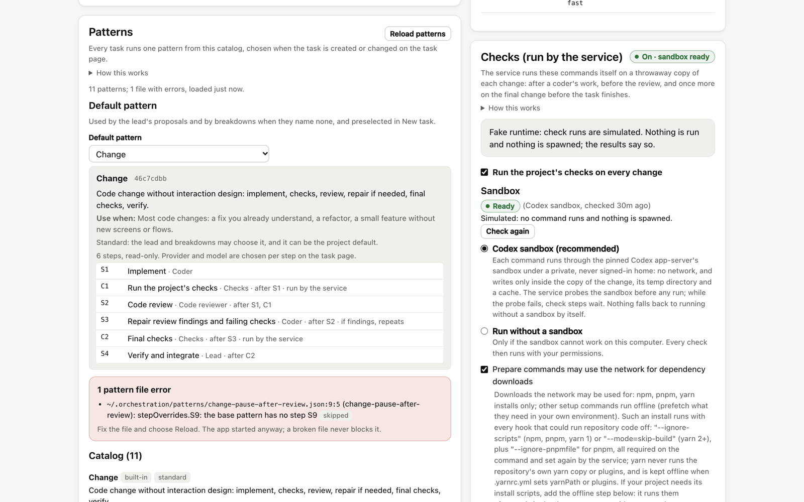
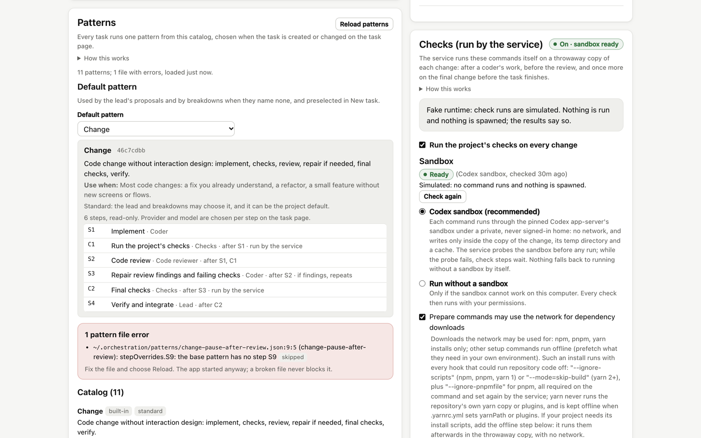

# Orchestrator


**A playground for running a team of AI coding agents, and for finding out which ways of working actually pay off.**

You talk to one **lead**. It plans the work, writes a spec for every task, and runs each task through a pipeline of designers, coders and independent reviewers, on **Claude** and **Codex**, several tasks at once. You see every track's progress at a glance. You step in only where something needs you, and you review artifacts and working results rather than every detail.

**Default: one implementation, then independent review.** Choose Claude or Codex and a model for each step. Using both providers does not require building the same change twice. Competing implementations (Best of N) are an experimental pattern only you can choose; no standard pattern uses them.

### Try the demo in a minute

The demo needs no API keys and runs no agents, and nothing leaves your computer:

```bash
git clone https://github.com/erickb336/orchestrator.git
cd orchestrator
npm install
npm start
```

It opens a sample project on a simulated runtime, with a short tour. It needs Node.js 22.13 or newer. To use your own repository with real agents, see [Install](#install).


*The demo: a sample project on the simulated runtime. No agents run, and every run shown is simulated.*

## What you get that a single chat does not

A single Claude Code or Codex chat is one agent, one conversation, and one provider. It stops when the chat stops, and its only reviewer is the agent that wrote the code. Orchestrator changes that:

| In a single chat | With Orchestrator |
| --- | --- |
| One thread of work. To know where things stand, you scroll the transcript or ask. | A board shows every feature's progress at once: what is proposed, running, in review, waiting for you, or done. You can look into any track without interrupting the others. |
| One agent works on one thing at a time. | A team works at once: up to 16 workers across many tasks, each in its own copy of your repository. |
| You start building before the goal is clear. | You can shape the vision first. The lead asks targeted questions, suggests what you missed, and drafts the vision and a first roadmap with you. Nothing runs until you say so. |
| Whether the tests ran depends on the agent. | The service runs your own test, lint and build commands in a sandbox before work is delivered, and failures go back for repair. |
| The agent that wrote the code also checks it. | An independent reviewer checks every change, from the other provider if you choose (Codex writes, Claude reviews, or the reverse). Repairs repeat until the review is clean. |
| You prompt for every next step. | A lead plans toward your vision, writes a spec for each task, and keeps work moving on a cadence and within limits you set. |
| Work lives in a transcript and is gone when the chat ends. | Every task keeps its spec, the decision and why, the artifacts, and what was verified. You can come back days later and see all of it. |
| To change direction, you interrupt and re-explain. | You tell the lead in one sentence, from any page, while work continues. It changes the focus, reorders the board, and defers what no longer fits. It lists each change, and you can undo any of them. |
| To correct one piece of work, you interrupt and re-explain. | You pause any step, edit what it produced (a design, the findings, a breakdown), and resubmit. Later steps follow your version. |
| A big goal has to fit in one context. | A goal is broken into child tasks that run in parallel, are evaluated, and are planned again until the goal is met. |
| You copy results into your branch yourself. | Verified work is merged in order and delivered to your branch or as GitHub pull requests. A pull request can wait for you, or merge by itself once an independent review is clean and your required checks pass. |
| You read everything before it lands, or you do not look at all. | Everything that landed sits in a review-later list. Look at it when you like, mark it reviewed, or send it back as a fix or a revert. The list never blocks delivery. |
| The way of working is whatever you typed this time. | Pipelines come from patterns: tested workflows (design → implement → review → repair → verify, and variants), each a small JSON file versioned like code. You choose one per task. |

In short: a chat is one pair of hands on one track. Orchestrator is a team on many tracks, with a lead, a process, a record, and one place to see how each track is going. You decide how involved to be, from approving each task to letting it run end to end.

## Why I built it

I use several AI agents every day, and the bottleneck is no longer writing code: it is me.

- juggling chats;
- re-explaining direction;
- checking whether "the tests pass" is true;
- reading every diff.

Orchestrator is my playground for changing that. It is a place to develop and test different patterns for using multiple agents in my own workflows. The goal is to take myself out of the loop as much as possible: I review artifacts and working prototypes rather than details, and I spend my time on solutions that can be tested end to end.

It is deliberately small, local and readable, so that changing it is cheap, and I can tailor it whenever my way of working changes. If you use it, treat it the same way: fork it and make it yours.

### Measuring, not guessing

- **Every task records which pattern it ran,** with the pattern's id, a content hash and its source.
- **When a task finishes, it records an outcome:** runs, tokens and cost where the provider reports them, repair rounds, findings, check results and review coverage. This is recorded from now on, so that ways of working can be compared on real data ([ORC-016](docs/tasks/ORC-016.md)).
- **"The tests pass" is a record, not a claim.** The service runs your project's own checks itself, in a sandbox, and keeps the results ([ORC-013](docs/tasks/ORC-013.md)).
- **Usage per provider and model:** runs, tokens and cost, for today and for all time.
- **Not built yet:**
  - a view that compares patterns on those outcomes;
  - OpenTelemetry trace export to Phoenix or Langfuse;
  - SWE-bench Verified runs through patterns.

### UX decisions

- **Truthful states.**
  - "Paused" appears only after the runtime confirms the stop; until then it says "Pausing".
  - A late result from a run that started before you edited the spec or changed the pipeline is discarded, not integrated ([ORC-001](docs/tasks/ORC-001.md), [ORC-016](docs/tasks/ORC-016.md)).
- **Only what needs you.** The Overview leads with progress by area and a short "Needs you" list. Everything else keeps moving ([ORC-017](docs/tasks/ORC-017.md)).
- **Every change can be undone.** When the lead steers, it lists exactly what it changed, and each change has an Undo ([ORC-009](docs/tasks/ORC-009.md)).
- **Think before spending.** In the shaping stage nothing runs. The lead asks targeted questions and drafts the vision with you ([ORC-012](docs/tasks/ORC-012.md)).
- **You choose how involved to be:** Autopilot, check in before work starts, or only when you ask. Specs are published for you to read; they are never approval gates.
- **Accessible by default.**
  - Colour carries meaning only, and always comes with a word.
  - Text contrast is at least 4.5:1 in light and dark.
  - Reduced motion is respected.
  - Phone layouts never scroll sideways ([ORC-017](docs/tasks/ORC-017.md)).

### How it was made

Orchestrator was built the way it works.

- **Who did what.** I set the direction and made the calls. AI agents in Claude Code wrote the specs and the code: a lead that planned and integrated, and the designer, coder and reviewer agents it delegated to.
- **Specs first.** Every feature started as a versioned spec with options, trade-offs and the chosen approach ([`docs/tasks/`](docs/tasks/)). The larger ones also have a design document ([`docs/design/`](docs/design/)).
- **Independent review.** Each implementation was reviewed by a separate agent, and every finding was fixed with a regression test.
- **Tests that bite.** Each key guard was checked by reverting it and confirming that a test fails.
- **The result:** over 900 automated tests, 16 feature specs so far, and a record of every decision and why it was made.

## What it does

- **One lead, any provider.** Either Claude or Codex can lead. The lead answers in a conversation, proposes fully specified tasks from your vision on a cadence you control, and wakes when work finishes, conflicts, or gets blocked.
- **Specs before work.** Every task has a versioned spec: the problem, the options with trade-offs, the lead's recommendation, and the selected approach. You can override the approach; the original recommendation and your reason are kept.
- **Pipeline patterns.** Each task runs one pattern from a catalog: Change, Feature, Bug fix, Investigation, Design, Goal, and labelled variants (one that pauses after the design, one reviewed by the other provider, two experiments). Each pattern is a JSON file: the built-in ones are in `patterns/` and change through commits; yours go in `~/.orchestration/patterns/`. Every step declares the artifacts it produces and the upstream artifacts it reads, and each step can still use its own provider and model, set on the task page. The pipeline's shape is never edited in the UI.
- **Artifacts you can see and edit.** Designs, code changes (real git commits), review findings, reports, and verification are versioned. Edit any of them and every later step that used it is re-run on your version.
- **Optional human-in-the-loop.** There are three levels:
  - **Autopilot:** runs end to end.
  - **Check in before work starts.**
  - **Only when I ask.**

  Independently of these, you can choose a pattern that pauses after a step (or write a two-line variant that does), or turn on step-by-step review for a task. Pause always works, and "Paused" is shown only after the runtime confirms the stop.
- **Shape the vision first** (optional). A new project can start in a shaping stage where nothing runs. The lead works with you as an active partner:
  - it asks a few targeted questions at a time, each with a reason and suggested answers;
  - it keeps a living draft of the vision, with its assumptions marked, and tracks which parts are clear and which are still open;
  - it proposes a first roadmap.

  You accept, edit or dismiss each draft, then choose **Start building**. Or skip shaping and start building right away.
- **Vision documents.** Attach files or a whole folder to the vision. The lead and designers read them; other roles see the list. Copies stay outside your repository, and each upload is one vision revision.
- **Steering by conversation.**
  - You can message the lead from any page while work continues. A message stops a planning run in progress, so yours is answered next.
  - From its reply the lead can change the focus, reprioritise open tasks, defer work that no longer fits (the current step finishes first), and drop its own proposals that have not started.
  - Every change is listed under the reply with Undo. Choices you made by hand are never overridden: a change to one of them becomes a suggestion.
  - A setting limits the lead to its own work, or to suggestions only.
- **Scale.**
  - Claude and Codex run concurrently: up to 16 workers, with separate limits per provider.
  - Failed steps can be retried automatically.
- **Delivery, three ways** (Settings → Delivery, one at a time, off by default).
  - **Off:** verified work is merged serially into an integration branch for you to merge.
  - **Local branch:** that branch is fast-forwarded into a branch of your repository, only when that is safe.
  - **GitHub pull requests:** one pull request per finished task. It is either held for you, or merged automatically after an independent review and passing required checks.
- **Quality gates.**
  - **Your own checks** (Settings → Checks, off by default). The service runs your project's test, lint and build commands on a throwaway copy of each change, in the Codex sandbox, and failures go to the repair step. Only you set the commands, and only you can accept failing checks.
  - **Sorted findings.** Each finding is marked "fix automatically", "needs a decision" or "no action", and repairs fix only what is decided. On Autopilot the lead makes those decisions; otherwise you do.
  - **Proof of review.** A review counts as clean only if it covered every changed file.
  - **CI triage.** In pull-request mode, a job GitHub cancelled is re-run once before a fix is spent on it, and review-bot failures come to you.
- **Review after it lands.** The Review page lists the pull requests that need you and everything that has landed. For each landed item you can read the summary, the agent review, the checks, and the diff. You can mark it reviewed, leave a note, or send it back as a fix or a revert.
- **Truthful and durable.**
  - Every change is a transaction in a local SQLite database.
  - A restart reconciles instead of guessing.
  - Runs are never shown as succeeding when they did not.

## Screenshots

All screenshots show the built-in sample project on the simulated runtime: no agents are running, and the pull requests and check runs are simulated.

**Tasks board.** Every task has a spec, a pipeline, and a truthful state. A card shows which provider is on it and at which step, and what needs you. Child tasks link to the goal they came from.


**Shape the vision first.** In the shaping stage nothing runs. The lead asks a few targeted questions, each with a reason and suggested answers, which you can answer by tapping. It keeps a living draft of the vision with its assumptions marked, and shows which parts are clear and which are still open. Vision documents you attach are listed here, and the lead reads them.



**Vision documents.** Attach files or a folder. Copies stay outside your repository, and each upload becomes one vision revision.



**Steering by conversation.** You tell the lead what to focus on, from any page, while work continues. The reply lists exactly what changed (here a new focus and one deferred task), and each change has an Undo.



**Pull requests that need you.** Each finished task becomes one pull request. The card shows the independent review and a checklist of what must hold before it merges. Here the pull request is held for you.



**Review after it lands.** Everything that landed is listed with its summary, agent review, and checks. You can mark it reviewed, leave a note, or send it back as a fix or a revert.



**Delivery settings.** Choose one: off, a local branch, or GitHub pull requests. With pull requests, choose whether each one is held for you or merged automatically after an independent review and passing checks.



**A large goal broken into child tasks.** The Goal pattern plans the work as child tasks and waits for them. Then it evaluates the result and plans the next round.


**Optional comparison example: best of two.** This task runs the experimental pattern "Change, best of two implementations", which only you can choose; it is not the default workflow. Codex and Claude each implement, and a reviewer compares the two and chooses one. Normally a single agent implements, followed by independent review and repair only if needed.


**Checks and findings.** The service runs your project's own checks on each change. A failing test becomes a finding marked "error, auto-fix", next to the review's own findings, each with its severity, its action, and the file and line. The repair step fixes them, and the checks run again.



**Checks gate the pull request.** The service runs the project's checks on the pull request's commit before it merges. If one fails, the pull request waits for you, and the card says why.



**Checks settings.** Only you set the commands. They run in the Codex sandbox, and the page says plainly what that sandbox does and does not stop.



**Versioned artifacts.** Every step's output is kept, and you can edit any of them. Candidates that were not chosen stay visible.


**Choosing a pattern.** Settings → Patterns (below) sets the project default and shows what each pattern does, when to use it, and a read-only preview of its steps. It also lists any pattern file with an error, by file, line and column; a broken file is skipped and never stops the app. New task, and Change pattern on the task page (before a task starts or while it is paused), use the same picker, with the catalog in groups: standard, pauses for you, experiments.



**Overview.** Progress by area: how far each part of the product is, which provider is working on it right now, and what needs you. Below it: everything waiting for you, the vision, and the conversation with the lead.


**How involved you want to be.** Choose Autopilot, "check in before work starts", or "only when I ask".


## When a plain chat is the better tool

For one small, focused change, use a single chat. It is faster and cheaper, because a pipeline spends extra tokens on the spec, the review, and any repair round.

Orchestrator pays off when the work is bigger than one sitting: many tasks, more than one day, or work you want to keep moving while you are away. These benefits come from how it is built. They have not yet been measured against real runs, so try it on a real goal next to a plain chat and compare the time, the cost, and the problems in each result.

## Install

Requires Node.js 22.13 or newer (it uses the built-in `node:sqlite`) and git.

```bash
git clone https://github.com/erickb336/orchestrator.git
cd orchestrator
npm run setup
npm start
```

**`npm run setup`** asks a few questions once:

- It checks Node and git, and installs dependencies if they are missing.
- It asks whether to run **real agents** or the **demo** (a sample project on a simulated runtime: no agents, no cost).
- **Codex:** it reports whether Codex is signed in and offers to run `codex login`. Codex uses your ChatGPT sign-in, with no separate bill.
- **Claude:** it asks how Claude signs in:
  - **Codex only.** Claude is not used, and Codex becomes the lead and every role's default.
  - **An Anthropic API key.** Billed per use, separately from any subscription.
  - **Your own Claude subscription token.** Opt-in, for personal use; see the note below.
  - **Cloud credentials** already set in your terminal: Bedrock, Vertex, Foundry, or Claude Platform on AWS.
- **On macOS,** it can store the key or token in your Keychain. You type it into macOS's own hidden prompt, and Orchestrator never sees it, saves it to a file, or shows it.
- It offers an `orchestrator` command you can run from any folder (through `npm link`).

The answers are saved to `~/.orchestration/launcher.json`, which never contains a key or token. Run setup again at any time to change them.

**`npm start`** (or `orchestrator`) builds and starts Orchestrator with those answers. It finds the Claude credential in your terminal or your Keychain, says what it is using, and opens http://127.0.0.1:5319 in your browser. Press Ctrl-C to stop it.

- **Other commands:** `npm run status` (or `orchestrator status`) shows what is saved and which credentials are found, never their values.
- **Start options:**
  - `--demo` or `--real` overrides the saved choice for one start.
  - `--port <n>` changes the port.
  - `--no-open` leaves the browser closed.
- **Environment variables** you set yourself always override saved answers.
- **Without setup,** `npm start` runs the demo.

Next, in the app, the Overview's **Get started** list takes you through connecting a repository, writing your vision, and choosing how involved you want to be (Autopilot, check in before work starts, or only when I ask). Settings → Providers shows each provider's status, and checking never starts a model run.

**About your own Claude subscription token.** Setup runs `claude setup-token` for you if Claude Code is installed. Claude workers and the lead then run on your plan's usage limits, which are shared with your own Claude Code, and several workers use those limits up quickly. **Check this is allowed for you:** Anthropic's Agent SDK documentation says, "Unless previously approved, Anthropic does not allow third party developers to offer claude.ai login or rate limits for their products, including agents built on the Claude Agent SDK." It does not say whether a subscriber may use their own token in their own tool.

Without setup, the same choices are environment variables:

- `ORCHESTRATION_RUNTIME=real`
- `ANTHROPIC_API_KEY`, or `ORCHESTRATION_CLAUDE_AUTH=subscription` together with `CLAUDE_CODE_OAUTH_TOKEN`
- the cloud flags, such as `CLAUDE_CODE_USE_BEDROCK=1`

In subscription mode no API key or cloud setting is passed to workers.

### Running real agents

What real runs do on your machine:

- Every run gets its own git worktree under `~/.orchestration/worktrees`, outside your repository's working tree.
  - Coders commit on `orchestration/<project>/<task>/<step>/<run>` branches (the service makes the commits).
  - Every other role gets a read-only checkout.
  - Finished work is merged, one task at a time, into `orchestration/<project>/integration`.
  - With automatic delivery on, that branch is fast-forwarded into your chosen branch, but only when your working tree is clean. Your latest commits are merged into the integration branch first.
- **GitHub pull requests** (Settings → Delivery, off by default) are a third delivery mode, never on together with local delivery:
  - Each finished task becomes one pull request on a branch the app owns (`orchestration/<project>/pr/<task>-<n>`), opened with your own `gh` sign-in. The app never reads or stores a token, never forces a push, and publishes only commits Orchestrator made.
  - **Hold and notify** (default): an independent agent reviews the change, the app watches the required checks, and tells you once when the pull request is ready. You merge it on GitHub or with Merge in the app, which is tied to the commit you saw.
  - **Merge automatically** (a separate, explicit setting): the app merges one pull request at a time, and only when an independent review is clean for exactly that change, every required check passed on its exact head, GitHub reports it mergeable, it touches no protected file, and nothing is paused. It first brings the pull request up to date with the base and waits for the checks again, so what lands is what was tested.
  - The review is the task's own review when it provably saw the final change and ran on another provider than the writer. Otherwise the app starts one dedicated review task. It never swaps in another provider by itself.
  - In automatic mode a failed required check, open review findings or a conflict get one fix task, pushed onto the same pull request, at most two per pull request.
  - If the check on the base branch fails after a merge the app made, automatic merging pauses; a second failure within a day keeps it paused until you resume it. Nothing is reverted automatically.
  - Everything that lands is listed on the Review page, which never blocks anything. From there you can mark it reviewed, leave a note, or send it back as a fix or a revert.
  - Pull requests are opened, reviewed and merged only while the service is running. There are no webhooks.
- **Worker environment** is set per provider:
  - **Isolated** (default): workers see none of your settings, plugins, or web tools, and use only the MCP connections you tick.
  - **Use my local setup:** workers get your user-level Claude or Codex configuration, including all its MCP servers and plugins.
- **Limits:** Settings → Run limits caps turns, time, and Claude spend per run. Codex runs are bounded by time.

### Development

```bash
npm run dev        # service (restarts on change) + Vite UI at http://127.0.0.1:5317
npm run typecheck
npm test
npm run build
```

Environment variables:

- `ORCHESTRATION_RUNTIME` (`fake` or `real`)
- `ORCHESTRATION_DB` (default `~/.orchestration/orchestration.db`)
- `ORCHESTRATION_PORT` (default 5319)

**Regenerating the screenshots.** `npm run capture` retakes every README image, the hero and the animated tour from the demo. It needs Google Chrome (or `CHROME_PATH` pointing at a Chrome binary) and ffmpeg, starts the service in a throwaway data directory, and never touches `~/.orchestration`.

## Getting large goals done

To get the most out of your Claude and Codex capacity:

1. **Give the lead the whole goal.** Write it in the vision, or say it in the conversation. The lead breaks it into specified tasks. Raise "max proposals per run" and "max open lead proposals" in Settings → Autonomy for bigger goals.
2. **Assign providers where they are useful.**
   - Set worker and per-provider limits to match your workload and budget.
   - Parallelize distinct tasks; avoid duplicate implementations merely to keep both providers busy.
   - Give each role the provider and model that suit it. For example, Codex for implementation, Claude for design and independent review, or the reverse. Every step can be pinned individually.
3. **Parallelise inside tasks.**
   - Pipelines are graphs: steps with no dependency between them (for example code review and UX review) run at the same time.
   - Every built-in pattern runs **one agent** per step. **Best of N** is the experimental pattern "Change, best of two implementations": two agents implement, one on each provider, and a reviewer chooses one. Use it only when you want that comparison and its extra cost. **Parallel copies** (2–5 agents whose contributions are all kept, such as independent review findings) are available to patterns you write. Provider and model selection stays independent of the agent count.
4. **Break big goals into child tasks.** The **Goal** pattern plans the goal as a list of child tasks, which run concurrently with their own pipelines. When they finish, it evaluates the result and plans the next round (up to 5 rounds), then reports. The variant **Goal, review the plan first** pauses so you can edit the list before any child task exists.
5. **Let work iterate.** Built-in patterns repeat review → repair until the review is clean (up to 3 rounds). Patterns you write can loop other steps.
6. **Use Autopilot** for continuous planning, automatic retries, and automatic delivery. Choose a pattern that pauses only where you want to look. Outside Autopilot, child tasks wait for you to start them, like the lead's proposals.
7. **Steer through artifacts, not code.** When something is off, pause, edit the design, findings, breakdown, or brief, and resubmit. The next steps follow your version.

Limits that keep fan-out bounded:

- **Breakdowns:** 20 child tasks per breakdown, and 100 per task you created, counting all levels.
- **Child tasks:** they cannot use a pattern that breaks down again.
- **Parallel steps:** they cannot sit inside a loop, and a code change cannot run as copies (use best of N).
- **Pausing or cancelling:** it applies to a task's child tasks too, and resuming a task resumes the child tasks that were paused with it.
- **The lead's open-proposal cap:** child tasks count toward it, so a large goal paces the lead's other proposals.

## How it is built

```
patterns/     the built-in pipeline patterns, one JSON file each, and their JSON Schema
src/domain/   pure state transitions, commands, the pattern resolver, and their tests (no I/O)
src/runtime/  the runtime adapter contract
src/ui/       React UI (a client of the service)
server/       SQLite store, scheduler (lease, reconciliation, lead, integration),
              Claude and Codex adapters, git worktrees, HTTP API (loopback only)
docs/         the project specification, research, and one versioned spec per built feature
```

- **Commands.** Every change is a named command applied to the pure domain inside a transaction, recorded with an idempotency key.
- **Scheduling.** One scheduler holds a lease. It dispatches steps, supervises runs through adapters (start, interrupt with confirmation, kill), applies their reports, and runs the lead and the integration queue.
- **Extending it.** Adding a provider means implementing `server/runtimes/types.ts`. Adding a workflow means adding a pattern file; see the next section.

## Adding or changing a pipeline pattern

A pattern is one JSON file that says which steps a task runs, in what order, with which roles, inputs and outputs. The UI only chooses patterns; it never edits a pipeline's shape.

**Where files live.**

- Built-in patterns are in `patterns/` in this repository, validated against `patterns/pattern.schema.json`. They change through commits and pull requests, like any other code, and a changed built-in takes effect at the next start.
- Your own patterns go in `~/.orchestration/patterns/` (next to the database; Settings → Patterns shows the exact folder). The app keeps a copy of the schema there, so an editor can complete and check your file. Your files may be `.json` or `.jsonc` and may contain `//` comments and trailing commas.
- A file of yours with the same `id` as a built-in replaces it, and is marked "yours, replaces built-in". The pipelines the service owns (`revert`, `delivery-review`, `delivery-checks`) stay in code; a file with one of those ids is refused.

**An example.** This two-line variant pauses the built-in Bug fix after the reproduction. Save it as `~/.orchestration/patterns/bugfix-pause-after-repro.jsonc`:

```jsonc
{
  "$schema": "./pattern.schema.json",   // the app keeps a copy of the schema next to your files
  "id": "bugfix-pause-after-repro",      // must match the file name
  "name": "Bug fix, pause after the reproduction",
  "description": "Bug fix that stops after the reproduction so you can read it before the fix starts.",
  "whenToUse": "Bugs where a wrong reproduction would waste the fix.",
  "extends": "bugfix",                   // start from the built-in Bug fix
  "stepOverrides": {
    "S1": { "gate": true },              // pause after S1, Reproduce and diagnose
  },                                     // trailing commas are fine in your files
}
```

`extends` names the pattern to start from, and `stepOverrides` changes fields of its existing steps; `null` removes an optional field (`gate`, `runIf`, `iterate`, `parallel`, `waitForChildren`, `independentOf`, `checks`). A variant cannot add or remove steps, and `extends` chains are at most three deep. For a new shape, write a full file with a `steps` list instead; `patterns/change.json` is the simplest one to copy.

**Fields.**

| Field | Required | Meaning |
| --- | --- | --- |
| `id` | yes | `^[a-z][a-z0-9-]{1,39}$`, equal to the file name |
| `name`, `description`, `whenToUse` | yes | Shown in the picker; at most 60, 300 and 300 characters |
| `order` | no | Sort key in the picker, default 100 |
| `experimental`, `hypothesis` | no | `true` labels an experiment; a hypothesis (what it should show) is then required |
| `steps` | base patterns | 1–30 steps, each with `id`, `purpose`, `role`, `dependsOn`, `inputs`, `outputs`, and optionally `runIf`, `gate`, `iterate`, `parallel`, `waitForChildren`, `independentOf`, `checks.onFail` |
| `extends`, `stepOverrides` | variants | The base pattern and the fields to change |

**Reload.** Choose Reload in Settings → Patterns, and the app reads the files again without a restart. Tasks that already exist keep their steps: a pattern is copied into a task when it is created or chosen, so a later file change never alters running work.

**Validation.** Every file is checked in three layers: the JSON Schema (types, lengths, unknown fields), the pipeline graph rules (every dependency and input names an existing step and output, no cycles, no parallel step inside a loop, a code change never runs as copies), then the pattern rules: no step id ending in `-c<n>`, `-i<n>` or `-r<k>-fix`, `-r<k>-review`, `-r<k>-checks` (the service uses those for copies, loop rounds and check rounds), no `checks.only` (check commands belong to each project, so patterns run every configured check), best of N only with `experimental: true`, and the step that chooses among best-of candidates must be an agent, not Checks. A file with an error is listed in Settings → Patterns with its line and column and skipped; the app starts anyway, and if the file would have replaced a built-in, the built-in stays in effect.

**Who may choose what.** A pattern is "standard" when it is not experimental, does not pause for you, and has an independent code review of any code change. The lead's proposals, breakdown items and the project default use standard patterns only. Everything else is yours to choose, at New task or with Change pattern on the task page. Marking a file of yours `experimental` is also how you keep it away from the lead.

**Experiments.** A pattern marked `experimental` must state its `hypothesis`, which the picker shows. Every task records the pattern it ran (its id, a content hash of its resolved steps, and its source) and, when it finishes or is cancelled, an outcome record (runs, tokens and cost where reported, repair rounds, findings, checks and coverage). That is the data a later comparison of patterns is built on; nothing is compared or exported yet.

**Changing a task's pattern.** Before a task starts, or while it is Paused, Change pattern on the task page replaces the pipeline. It starts over from the new pattern; work already done stays on the record, labelled "earlier pattern", and is never reused. A provider or model pin stays on a step with the same id and role.

## Safety notes

- **Network:** the service binds to 127.0.0.1. It rejects foreign `Host` headers, cross-origin requests, and state changes without its client header.
- **Git:** all of the service's git commands run with hooks and fsmonitor disabled. A worktree whose git metadata was tampered with is not recorded.
- **Claude workers:** file tools are confined to their worktree, with no shell unless you enable it. **With shell access switched on (an opt-in), a Claude worker runs as you: it can reach this service's local API and your files.** Leave it off unless you need it.
- **Checks (ORC-013):** when you turn checks on, the service runs the repository's own code on this computer: its test scripts, its build, and whatever those start, including code agents wrote. In the Codex sandbox that code cannot write outside a throwaway copy of the change and cannot use the network; the one exception is a dependency download by npm, pnpm or yarn, which runs with every install hook off (`--ignore-scripts` or yarn's `--mode=skip-build`, `--ignore-pnpmfile` for pnpm, and yarn's own `yarnPath` and plugins never used), so no repository code runs while the network is on. Every other setup command (bun, pip, uv, poetry, bundle, gradle, mix, swift, cargo, go, make, …) runs offline; scripts a project needs run afterwards, offline, in a separate step. The sandbox does not stop that code from reading your files. The sandbox is probed before any run (writes outside the copy, connections to this machine's own loopback and to the network must all be refused), and nothing ever falls back to running unsandboxed by itself. Each command's exit status comes from the service's own wrapper process, never from anything the command can write. A cancelled CI job is re-run once through `gh api -X POST …/actions/jobs/<id>/rerun`, recorded like every other GitHub write, and only that endpoint, a pull request's comments and the read-only GraphQL query are ever sent as writes; a review bot's verdict and a skipped required check wait for you instead of starting a fix task, while a job cancelled because another job of its workflow run failed, cancelled again after its re-run, or cancelled at GitHub's job time limit is treated as a code failure.
- **Codex workers:** they run in Codex's sandbox. Writes are limited to their worktree and a private temp directory, and network access for commands is off. **They can still read files elsewhere on your machine.**
- **Connections:** MCP servers and plugins you allow run with your permissions and are not sandboxed.
- **GitHub:** only the service runs `gh` and `git push`. It never uses `--admin`, GitHub's own auto-merge, a forced push, a branch deletion or the merge API; the only merge is `gh pr merge --merge --match-head-commit <sha>`. A change to CI workflow files is not pushed until you allow it for that pull request, and a change to other protected files is never merged automatically. A worker environment set to "local", or Claude workers with a shell, can reach your GitHub sign-in: automatic merging is refused for local environments unless you allow it, and both are listed as warnings in Settings → Delivery. An agent review is not a human review; the required checks, the protected paths, the daily cap and the Review list are the independent layers.
- **Autopilot:** the lead reads summaries that workers wrote, and on Autopilot its proposals start without review. Treat repositories and connections you do not trust accordingly. Use "check in before work starts", or review gates, when that matters.
- **Steering by conversation (ORC-009):** when you give direction in the conversation, the lead may change the focus, reorder and defer open root tasks, and drop its own unstarted proposals. Only runs that answer your messages may steer, so worker-written summaries cannot steer through a planning run; a reply run still reads them. The damage is bounded: four verbs, at most 20 task changes and one focus change per reply, nothing is interrupted, nothing you created or started is cancelled, settings, specs and pins are out of reach, and every change is listed with Undo. The lead cannot steer the app's own delivery work: the review and fix tasks it creates for a pull request are rejected as not steerable and are left off the lead's board. Choices you made by hand (a priority, a pause) are never overridden. Settings can limit the lead to its own proposals or to suggestions only. Steering has been exercised only with scripted and simulated leads, not with real Claude or Codex lead runs.

## Status

This is a personal tool under active development. It is built in milestones (see `docs/tasks/`), each with an independent review:

| Milestone | Spec |
| --- | --- |
| Interface prototype, pipelines, and artifacts | ORC-001, ORC-002 |
| Durable local service | ORC-003 |
| Claude and Codex adapters | ORC-004 |
| Lead conversation, autonomy, and integration queue | ORC-005 |
| Reliability, autopilot, human editing, import/export, and CI | ORC-006 |
| Fan-out: parallel agents per step, iteration loops, breakdowns into child tasks | ORC-007 |
| Pull-request delivery, independent review and automatic merge, review-later list | ORC-008 |
| Steering by conversation: focus, priorities, defer and drop, with undo | ORC-009 |
| Opt-in Claude subscription token for personal use | ORC-010 |
| Guided setup and one-command start | ORC-011 |
| Shape the vision with the lead first | ORC-012 |
| Quality gates: service-run checks, finding triage, review coverage, CI triage, project conventions | ORC-013 |
| Vision documents | ORC-014 |
| Pipeline patterns instead of an editable pipeline; outcome records per task | ORC-016 |
| A demo worth showing: progress by area, a "Needs you" list, a first-run tour, the visual pass, and scripted README media | ORC-017 |

Real-provider behaviour is covered by adapter tests against scripted runtimes, plus `node scripts/real-run-test.mjs`. That test writes a one-step pattern file into a throwaway data directory, runs Claude and Codex workers concurrently on it against a throwaway repository, then pauses and resumes them, and records evidence. It needs your credentials; `--fake` runs the same checks at no cost. Steering by conversation (ORC-009) has been exercised only with scripted and simulated leads; no real Claude or Codex lead run has steered yet.

Pull-request delivery is covered by tests that never contact GitHub: a local bare repository stands in for the remote and a fake stands in for the GitHub API. `node scripts/pr-sandbox-check.mjs --repo <owner>/<throwaway-repo> --yes` records evidence against a real repository. It refuses to run without both arguments, never defaults to a repository, and creates branches, pull requests, a ruleset and a workflow there, so use a repository made for it. That run passed on 2026-09-30 against a sandbox repository with scripted agents standing in for Claude and Codex (25 of 25 checks; see `docs/tasks/ORC-008.md`). It has not been run with real Claude and Codex workers.

## License

MIT
