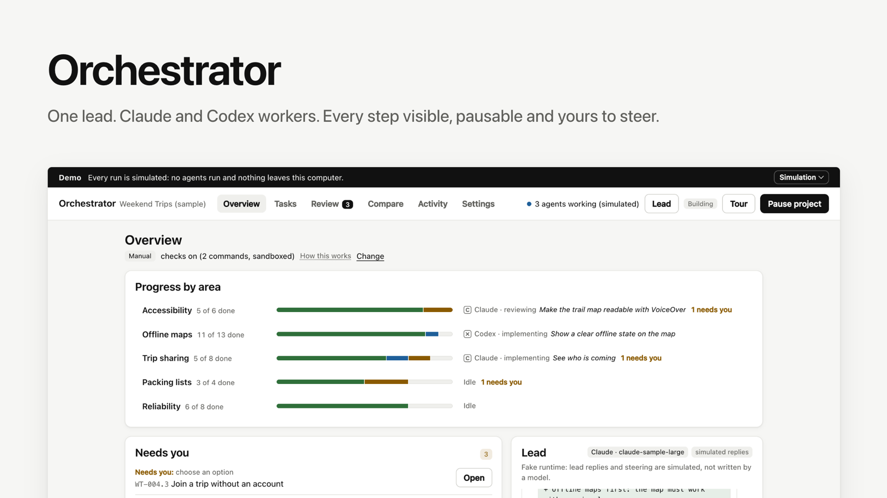
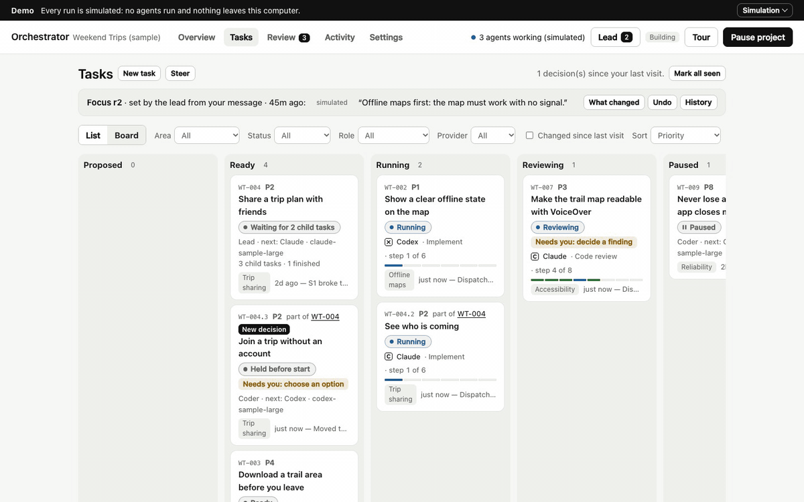
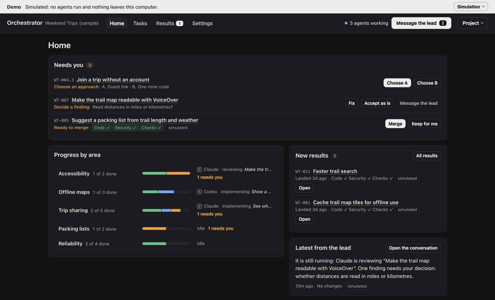
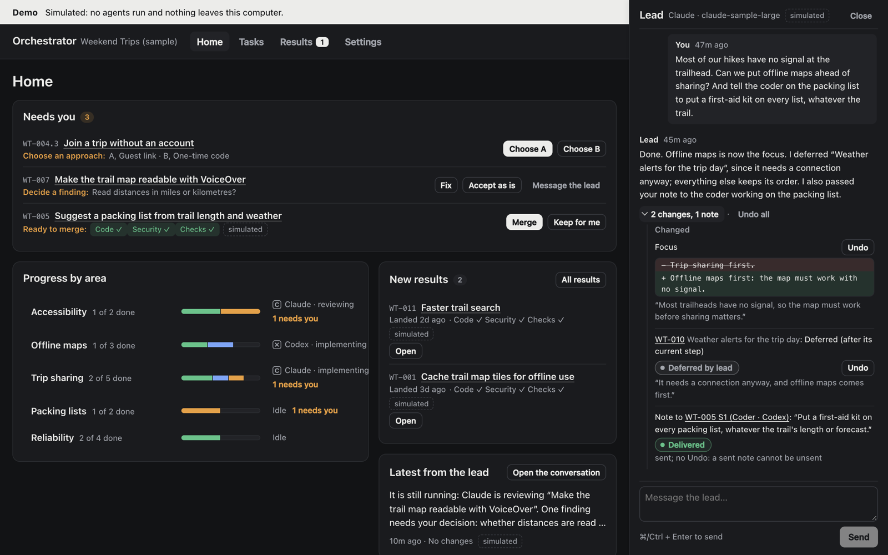
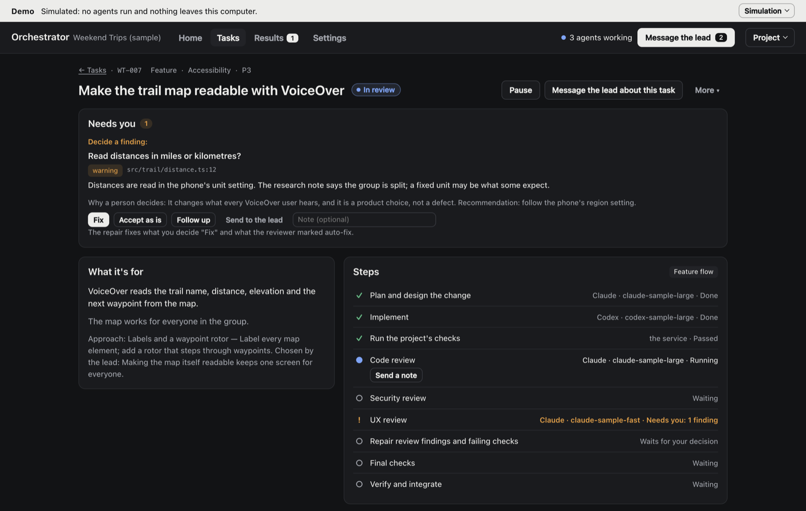
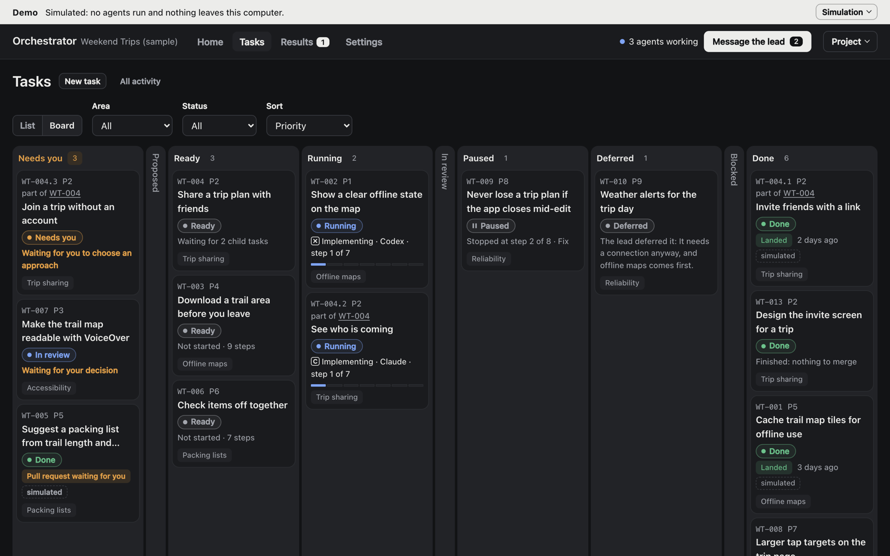
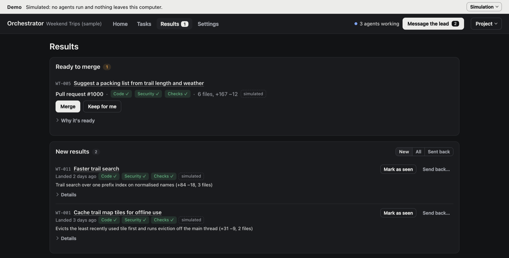

# Orchestrator



**One lead agent runs a team of Claude and Codex agents on your repository.** You set the vision and steer. The lead plans each task and runs it step by step, each step a fresh agent. You answer the few decisions that need you and look at results, not every detail.

Several tasks move at once. The service runs your checks itself, a different agent reviews each change, and a task reads Paused only once its agent has stopped.

## Try the demo

The demo needs no API keys and runs no agents, and nothing leaves your computer:

```bash
git clone https://github.com/erickb336/orchestrator.git
cd orchestrator
npm install
npm start
```

It opens a sample project (Weekend Trips, a hiking app) on a simulated runtime, with a short tour. It needs Node.js 22.13 or newer.



## How it works

1. **Shape the vision with the lead.** It asks targeted questions and drafts the vision with you. Nothing runs yet.
2. **The lead plans tasks.** Each task gets a versioned spec: the options, their trade-offs, and the chosen approach.
3. **It picks a flow for each task** (see below), and a provider and model for each step.
4. **Each step is a fresh agent** in its own copy of the repository, given only the earlier outputs it needs and a few working principles that fit its job (fix the root cause, the smallest change, prove it works), adapted from [pstack](https://github.com/cursor/plugins/tree/main/pstack) (MIT). Every agent and the lead also get one of our own, [*contextualize and write for the reader*](principles/contextualize-and-write-for-the-reader.md): whatever they write says where it fits, what was decided and what is left, so you can come in cold.
5. **The service runs your project's checks** (tests, lint, build). **Then a code review and a security review run side by side.** The coder repairs whatever any of them found, and they run again until all are clean.
6. **The lead verifies the result against the spec.** It is delivered as a branch or a pull request, which you merge or which merges automatically.
7. **You look at the results** whenever you like, and can send anything that landed back as a fix or a revert.



*Home: decisions answered in place, progress by area, and new results.*

### You can step in

- **Message the lead**, your main channel. It can change the focus, defer work or pass a note to a running coder, and every change has an Undo.
- **Send a note** to a running step yourself. It shows Delivered once the runtime has acknowledged it.
- **Pause** a task, **edit** a step's output (later steps use your version), or **rerun** a step.



*The lead changed the focus, deferred a task (with Undo) and passed your note to a coder at work.*



*A task page: the finding to decide, then each step in plain words.*

### The six flows

| Flow | For | Steps |
| --- | --- | --- |
| **Change** | Most code changes | implement → checks → code review and security review side by side → repair until clean → final checks → the lead verifies |
| **Bug fix** | A defect you can reproduce | reproduce → then as Change; the lead confirms the bug is gone |
| **Feature** | New screens, flows or copy | design → implement → checks with a UX review beside them → code and security review → repair → final checks → verify |
| **Design** | Settling a design first | design → UX review → revise → the lead writes the implementation brief |
| **Investigation** | The cause is unknown | gather evidence → review it → revise the report while the review finds something (up to three rounds) → the lead proposes a spec (no code) |
| **Goal** | Work too big for one task | the lead breaks it into child tasks that run in parallel, then evaluates and re-plans |

Each flow is a short JSON file in [`flows/`](flows/). To change one, edit its file and run `npm test`. The security review adds one review run per round.



*Tasks: every task's state, with what needs you first.*



*Results: merge what is ready, mark a result as seen, or send it back.*

## Why I built it

I use several AI agents every day, and the bottleneck is no longer writing code: it is me. I juggle chats, re-explain direction, check whether "the tests pass" is true, and read every diff. Orchestrator is my playground for trying ways of using several agents in my own workflow, to take myself out of the loop as much as possible and review artifacts and working results instead of details.

It is deliberately small, local and readable, so that changing it is cheap. Fork it and make it yours.

**How it was made.**

- I set the direction and made the calls. AI agents in Claude Code wrote the specs and the code: a lead, plus designer, coder and reviewer agents.
- Every feature started as a versioned spec with options and trade-offs ([`docs/tasks/`](docs/tasks/)).
- Each feature's implementation was reviewed by a separate agent, and every finding was fixed with a regression test.
- The UI was then audited (about 300 controls on 13 screens, "needs you" worded four ways) and rebuilt UI first, from target screens I approved, on one component kit ([ORC-025](docs/tasks/ORC-025.md)). Each pass was checked in the browser at desktop and phone widths.

## Use it on your own repository

```bash
npm run setup   # asks once: real agents or the demo, and how Claude and Codex sign in
npm start
```

**Signing in:**

- **Claude:** an Anthropic API key, cloud credentials, or (opt-in, for personal use) your own Claude subscription token. Read [the note on subscription tokens](docs/real-agents.md#your-own-claude-subscription-token) before using one.
- **Codex:** your ChatGPT sign-in.
- **Your keys never pass through Orchestrator.** They stay in your Keychain or your environment.

Details: [docs/real-agents.md](docs/real-agents.md).

## Safety in brief

- **Local only.** The service runs on your computer and listens on 127.0.0.1 only.
- **Isolated worktrees.** Every agent works in its own git worktree. Your branch changes only by a fast-forward of verified work, or through a pull request.
- **Sandboxed agents.** Codex agents run in Codex's sandbox. Claude agents have no shell.
- **Sandboxed checks.** Your project's checks run in a sandbox with no network, except dependency installs, which run with every install hook off.
- **Narrow GitHub use.** On GitHub the app only ever merges the exact commit that was verified. It never force-pushes or uses admin rights.

Full notes: [docs/safety.md](docs/safety.md).

## Development

```bash
npm run dev        # service + UI at http://127.0.0.1:5317, restarting on change
npm run typecheck
npm test
npm run build
npm run capture    # retake the README images from the demo (needs Chrome and ffmpeg)
npm run test:integration   # the end-to-end scenario on simulated agents (about 90 s; CI runs it)
npm run test:real          # the same scenario with real Claude and Codex agents (your credentials; about $0.19 last time)
```

**Where things are:**

- `src/domain/`: pure state and commands, no I/O.
- `server/`: the SQLite store, the scheduler, the Claude and Codex adapters, git worktrees, and the HTTP API.
- `src/ui/`: the React app, in one dark theme.
- `src/ui/kit/`: the component kit every screen is built from; open `#/kit` in the running app to see each component in every state. A test fails when a screen sets a font size or colour inline, so new screens use the kit.
- `flows/` and `principles/`: the flows, and the principles agents are given.
- `docs/tasks/`: one spec per milestone.

## Status

A personal tool under active development. It was built in milestones ORC-001 to ORC-031, each with a spec in [`docs/tasks/`](docs/tasks/) giving the options, the decision and the evidence. Twenty-three are done, four were dropped, and four are planned or in progress. Later milestones sometimes replaced earlier ones; the last column says what survives.

**The foundation** (the five milestones in the [project spec](docs/PROJECT_SPEC.md), plus pipelines):

| Milestone | What it added | Today |
| --- | --- | --- |
| [ORC-001](docs/tasks/ORC-001.md) Interface prototype | A board of tasks, a task page, and a spec editor where each edit is a new revision | Done; rebuilt in ORC-025 |
| [ORC-002](docs/tasks/ORC-002.md) Step pipelines | Tasks as steps that pass named outputs to later steps, from templates | Done; editing pipelines in the UI was replaced by files (ORC-016, then ORC-021) |
| [ORC-003](docs/tasks/ORC-003.md) Durable service | A local service that owns state in SQLite: every change a checked command, one scheduler, recovery after a restart | Done |
| [ORC-004](docs/tasks/ORC-004.md) Claude and Codex adapters | Real agents in isolated git worktrees, with pause and resume that wait for the agent to confirm | Done; **verified with real models** (below) |
| [ORC-005](docs/tasks/ORC-005.md) The team loop | A lead agent on either provider that plans tasks from the vision; an integration queue; limits on what it does alone | Done |
| [ORC-006](docs/tasks/ORC-006.md) Ready to publish | Install steps, a first-run guide, notifications, worktree cleanup, import and export, CI | Done |

**Scale and steering:**

| Milestone | What it added | Today |
| --- | --- | --- |
| [ORC-007](docs/tasks/ORC-007.md) Fan-out | A step can break work into child tasks that run in parallel; a step can run several agents | Done; child tasks live on in the Goal flow. Several agents per step and best-of were removed in ORC-025 |
| [ORC-008](docs/tasks/ORC-008.md) Pull-request delivery | Delivery as pull requests that you merge or that merge after review, and a queue of results to look at later | Done; run against a real GitHub repository with scripted agents |
| [ORC-009](docs/tasks/ORC-009.md) Steering by conversation | Message the lead to change the focus, priorities or plans, with Undo | Done |
| [ORC-010](docs/tasks/ORC-010.md) Your own Claude subscription | Opt-in: Claude agents run on your own subscription token instead of an API key | Done; used in the real run |
| [ORC-011](docs/tasks/ORC-011.md) Guided setup | `npm run setup` once, then `npm start` | Done |
| [ORC-012](docs/tasks/ORC-012.md) Shape the vision first | The lead asks questions and drafts the vision with you before anything runs | Done |
| [ORC-013](docs/tasks/ORC-013.md) Quality gates | The service runs your checks in a sandbox; each review finding is triaged; review coverage is recorded | Done |
| [ORC-014](docs/tasks/ORC-014.md) Vision documents | Attach files or a folder to the vision | Done |
| ORC-015 Phone access | Reaching the app from a phone | Dropped |
| [ORC-016](docs/tasks/ORC-016.md) Patterns | Pipelines as JSON pattern files instead of a UI editor | Done; simplified into six flows by ORC-021 |
| [ORC-017](docs/tasks/ORC-017.md) A demo worth showing | The sample story, the first-run tour and the README media | Done; story and tour redone in ORC-025 |
| ORC-018 to ORC-020 | Comparing patterns, benchmark runs, rotating patterns automatically | Dropped to keep the tool simple (ORC-018 was built, then closed unmerged) |

**Simpler and sharper:**

| Milestone | What it added | Today |
| --- | --- | --- |
| [ORC-021](docs/tasks/ORC-021.md) Flows | Six plain flows in place of the pattern catalog, and a security review beside every code review | Done |
| [ORC-022](docs/tasks/ORC-022.md) Notes to a running agent | Through the lead or directly; a note shows Delivered once the runtime acknowledges it | Done; **verified with real models** (below) |
| [ORC-023](docs/tasks/ORC-023.md) Orchestrator inside Claude Code | A Claude Code plugin to talk to the lead of the repository you are in, also from your phone through Remote Control | **Planned** |
| [ORC-024](docs/tasks/ORC-024.md) Working principles | Fifteen principles adapted from pstack, given to each step's agent where they fit | Done |
| [ORC-025](docs/tasks/ORC-025.md) UI audit and rebuild | One dark theme, a component kit, every screen rebuilt, a new demo | Done |
| [ORC-026](docs/tasks/ORC-026.md) Write for the reader | A sixteenth principle, our own, given to every agent and the lead | Done |
| [ORC-027](docs/tasks/ORC-027.md) The real-run test, committed | The end-to-end scenario runs in CI on simulated agents; `npm run test:real` runs it with real ones and leaves a record in [`docs/real-runs/`](docs/real-runs/) | Done |
| [ORC-028](docs/tasks/ORC-028.md) Fixes from the real run | Investigation revises its report while its review finds something, and a rule keeps every flow from dropping review findings | Done; **verified with real models** |
| [ORC-029](docs/tasks/ORC-029.md) The vision studio, before the factory | Shape the product with the lead on prototypes you can click (demo sites, mobile mockups, terminal demos), inputs and outputs, and flows; the approved blueprint is what the factory builds from | **Planned** |
| [ORC-031](docs/tasks/ORC-031.md) Subagents in research steps | Let agents in explicitly read-only research steps start their provider's own subagents, counted, costed, capped and shown; writers stay single-session; each provider is switched on only after real runs prove pause and cost | **Planned** (after ORC-029) |

**Verified with real models: the core run, notes and review repair, not every feature.** The scenario behind `npm run test:real` has run four times with real agents, all on 2026-10-01, and grew with each fix; every run's record is in [`docs/real-runs/`](docs/real-runs/). The latest (15 of 15 checks, from a clean commit) showed:

- a Codex agent (gpt-6.1-sol) and a Claude agent (Haiku 4.5) worked at the same time, each in its own worktree;
- Pause showed "Pausing" until each runtime confirmed the stop (1.5 to 2 seconds), and Resume started a fresh attempt;
- a project-wide pause reached both;
- **a note sent as soon as each agent was dispatched was acknowledged by both runtimes** (Codex in 1.8 seconds, Claude in 5.8);
- **the Claude task's review found an error in its report** (a wrong line count, given in answer to the note) and a gap. The revise step fixed both, on Codex, and the second review was clean. Before [ORC-028](docs/tasks/ORC-028.md), such findings were left open and the task still read Done;
- both tasks finished with the lead's spec, and the managed repository's `main` was untouched.

It took 88 seconds and about $0.19 of Claude usage. **Not yet run with real models:** pull-request delivery, conversations with the lead (and notes the lead sends), whether the principles change what agents do, and a Codex note that arrives before its turn starts (held by the adapter; covered by tests, but no real run has hit that moment yet). Every feature is also tested against simulated and scripted Claude and Codex runtimes, and CI runs the same scenario on simulated agents.

## License

MIT. See [LICENSE](LICENSE).
