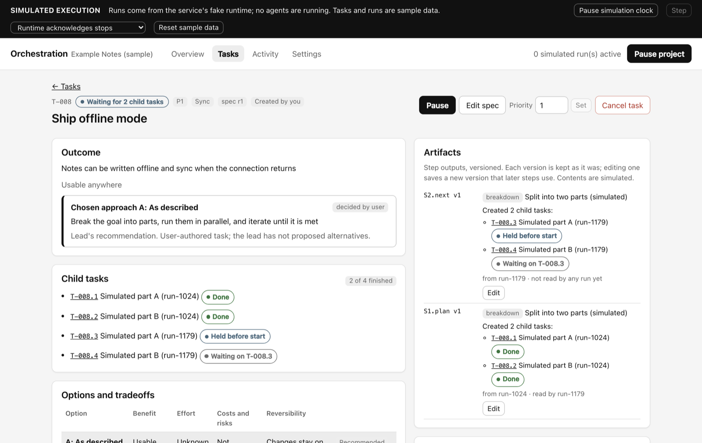
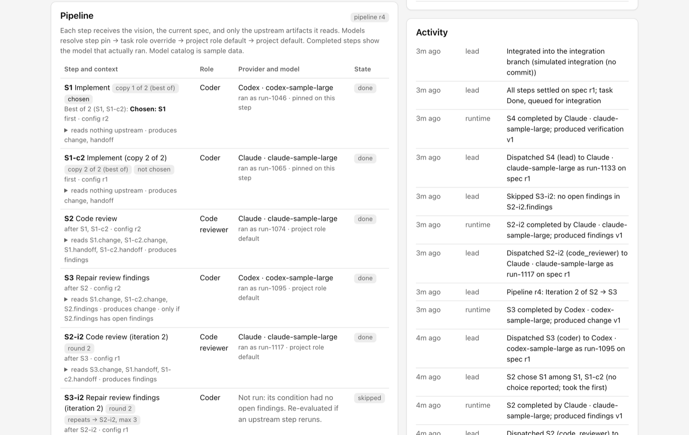
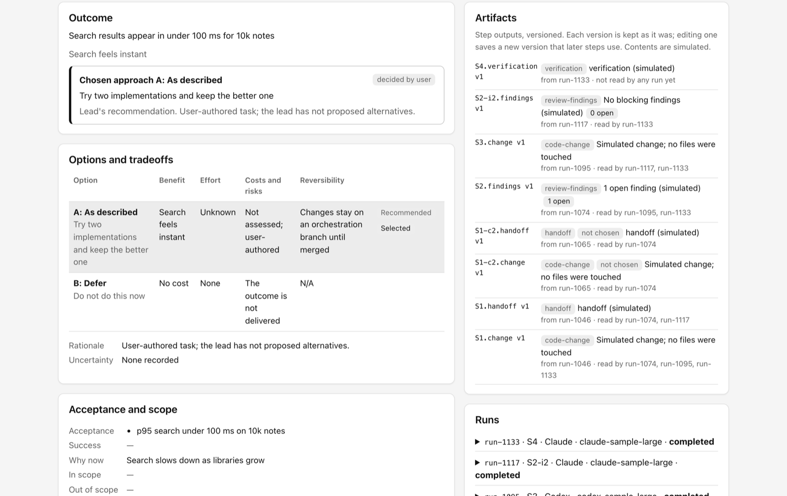
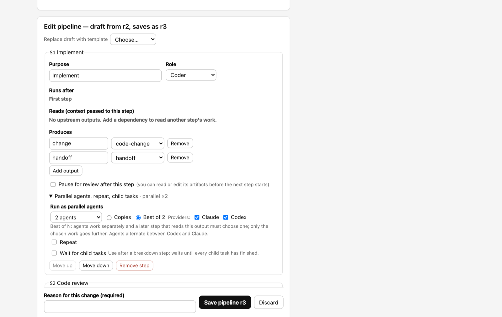
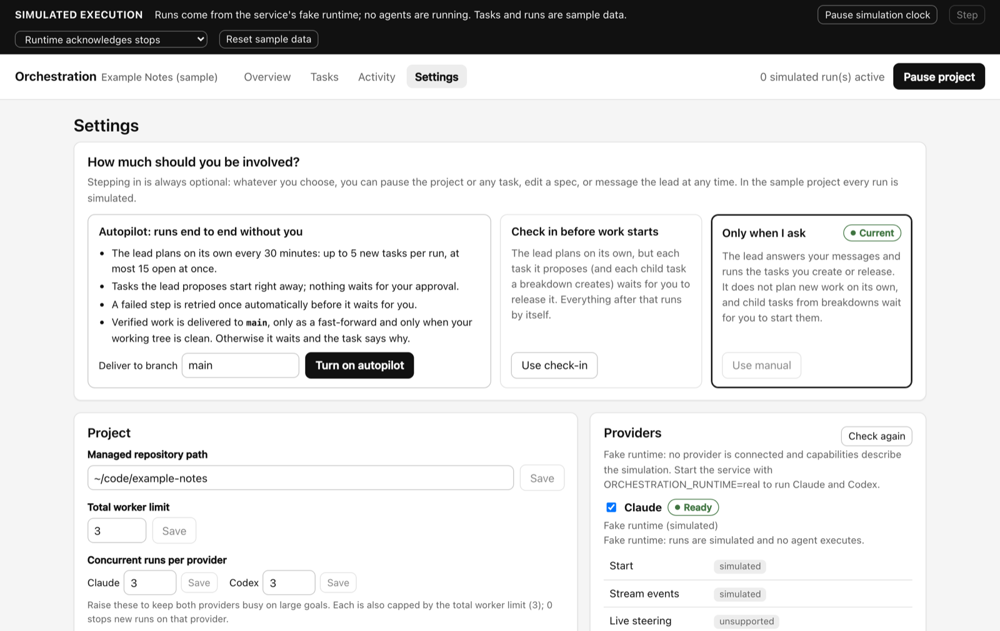

# Orchestration

A local orchestrator for teams of AI coding agents. You talk to one **lead**; it plans the work, writes a specification for every task (options, trade-offs, the approach it chose), and runs each task through an editable pipeline of **Claude** and **Codex** workers: designers, coders, and independent reviewers, running concurrently. You can let it run on autopilot or step in anywhere: pause, read and edit any artifact, and resubmit it through the rest of the pipeline.

## Why this exists

I wanted my own agent orchestration tool, one I can quickly edit and extend with features and fixes whenever I need them, instead of adapting my work to someone else's product. The goal is to keep improving it and tailoring it to myself and my own workflows. It is deliberately small, local, and readable, so that changing it is cheap. If you use it, treat it the same way: fork it and make it yours.

## What it does

- **One lead, any provider.** Either Claude or Codex can lead. The lead answers in a conversation, proposes fully specified tasks from your vision on a cadence you control, and wakes when work finishes, conflicts, or gets blocked.
- **Specs before work.** Every task has a versioned spec: the problem, the options with trade-offs, the lead's recommendation, and the selected approach. You can override the approach; the original recommendation and your reason are kept.
- **Editable pipelines.** Each task runs a pipeline of steps (design → implement → review → repair if needed → verify, or any shape you build). Every step declares the artifacts it produces and the upstream artifacts it reads, and each step can use a different provider and model.
- **Artifacts you can see and edit.** Designs, code changes (real git commits), review findings, reports, and verification are versioned. Edit any of them and every later step that used it is re-run on your version.
- **Optional human-in-the-loop.** There are three levels:
  - **Autopilot:** runs end to end.
  - **Check in before work starts.**
  - **Only when I ask.**

  Independently of these, you can add review gates to single steps, or turn on step-by-step review for a task. Pause always works, and "Paused" is shown only after the runtime confirms the stop.
- **Scale.**
  - Claude and Codex run concurrently: up to 16 workers, with separate limits per provider.
  - Failed steps can be retried automatically.
  - Verified work is merged serially into an integration branch and, if you want, fast-forwarded into your branch.
- **Truthful and durable.**
  - Every change is a transaction in a local SQLite database.
  - A restart reconciles instead of guessing.
  - Runs are never shown as succeeding when they did not.

## Screenshots

All screenshots show the built-in sample project on the simulated runtime (no agents running).

**Tasks board.** Every task has a spec, a pipeline, and a truthful state. Child tasks link to the goal they came from.


**A large goal broken into child tasks.** The Goal template plans the work as child tasks and waits for them. Then it evaluates the result and plans the next round.



**Best of two, then review → repair until clean.** Codex and Claude each implement, and the review chooses one. A repair round runs, and the second review comes back clean, so the loop stops.



**Versioned artifacts.** Every step's output is kept, and you can edit any of them. Candidates that were not chosen stay visible.



**Pipeline editor.** Each step sets its inputs, its outputs, parallel agents (copies or best of N, across providers), repeats, and whether it waits for child tasks.



**Overview and the lead.** The Overview shows the vision, what changed since your last visit, and the conversation with the lead.


**How involved you want to be.** Choose Autopilot, "check in before work starts", or "only when I ask".



## When it helps, and when it does not

A single Claude Code or Codex session is already strong. It can plan, use sub-agents, work for a long time, and run tasks in parallel inside one provider. Orchestration is worth its overhead when you want things a single session does not give you:

- **Both providers on one goal.** Claude and Codex work on the same goal concurrently, and each checks the other's work (for example, Codex implements and Claude reviews).
- **Durable records.** Specs, decisions, and artifacts outlast any single chat. You can come back days later and see what was decided, why, and what was verified.
- **Control at every step.** You can pause any step (with confirmation), edit what it produced, and resubmit it through the rest of the pipeline.
- **Explicit, repeatable workflows.** Pipelines, loops (review → repair until clean), parallel candidates (best of N), and breakdowns into child tasks are workflows you can edit and reuse.
- **Always-on, bounded autonomy.** A lead can keep proposing and shipping work toward a vision within limits you set, and integrate it serially.

It is **not** a net win for a single focused change. There, a plain chat is faster and cheaper, because the pipelines spend extra tokens on specs, reviews, and iterations. The benefits have not yet been measured against real runs. The honest way to decide is to give the same goal to a single session and to Orchestration, then compare the elapsed time, the cost, and how many problems each result has.

## Install

Requires Node.js 22.13 or newer (it uses the built-in `node:sqlite`) and git.

```bash
git clone https://github.com/erickb336/orchestration.git
cd orchestration
npm install
npm start
```

Open http://127.0.0.1:5319. The first start shows a **sample project** running on a **simulated runtime** (no agents, no cost), so you can explore safely.

### Running real agents

```bash
ORCHESTRATION_RUNTIME=real npm start
```

1. **Credentials.** Set them in the environment the service starts from. Settings → Providers shows each provider's status; checking never starts a model run.
   - **Claude:** `ANTHROPIC_API_KEY`, or Bedrock/Vertex/Foundry settings. Anthropic does not allow third-party Agent SDK apps to use a Claude.ai subscription login.
   - **Codex:** your local Codex sign-in (`npx codex login`) or an API key (`printenv OPENAI_API_KEY | npx codex login --with-api-key`).
2. **Project.** In Settings → Project, point Orchestration at a git repository with at least one commit, and write a vision.
3. **Involvement.** Choose how involved you want to be (Autopilot, check in before work starts, or only when I ask), then message the lead or create a task.

What real runs do on your machine:

- Every run gets its own git worktree under `~/.orchestration/worktrees`, outside your repository's working tree.
  - Coders commit on `orchestration/<project>/<task>/<step>/<run>` branches (the service makes the commits).
  - Every other role gets a read-only checkout.
  - Finished work is merged, one task at a time, into `orchestration/<project>/integration`.
  - With automatic delivery on, that branch is fast-forwarded into your chosen branch, but only when your working tree is clean. Your latest commits are merged into the integration branch first.
- **Worker environment** is set per provider:
  - **Isolated** (default): workers see none of your settings, plugins, or web tools, and use only the MCP connections you tick.
  - **Use my local setup:** workers get your user-level Claude or Codex configuration, including all its MCP servers and plugins.
- **Limits:** Settings → Run limits caps turns, time, and Claude spend per run. Codex runs are bounded by time.

### Development

```bash
npm run dev        # service (restarts on change) + Vite UI at http://127.0.0.1:5317
npm run typecheck
npm test
npm run build
```

Environment variables:

- `ORCHESTRATION_RUNTIME` (`fake` or `real`)
- `ORCHESTRATION_DB` (default `~/.orchestration/orchestration.db`)
- `ORCHESTRATION_PORT` (default 5319)

## Getting large goals done

To get the most out of your Claude and Codex capacity:

1. **Give the lead the whole goal.** Write it in the vision, or say it in the conversation. The lead breaks it into specified tasks. Raise "max proposals per run" and "max open lead proposals" in Settings → Autonomy for bigger goals.
2. **Keep both providers busy.**
   - Raise the worker limit.
   - Set per-provider limits to match your plans.
   - Give each role the provider and model that suit it. For example, Codex for implementation, Claude for design and independent review, or the reverse. Every step can be pinned individually.
3. **Parallelise inside tasks.**
   - Pipelines are graphs: steps with no dependency between them (for example code review and UX review) run at the same time.
   - Any step can run as **2–5 agents at once**. **Copies** (for example three reviewers, one per provider) all contribute: review findings are added together. **Best of N** (for example a Claude and a Codex implementation) lets the next step choose one; you can change the choice yourself.
4. **Break big goals into child tasks.** The **Goal** template plans the goal as a list of child tasks, which run concurrently with their own pipelines. When they finish, it evaluates the result and plans the next round (up to 5 rounds), then reports. You can edit the list at a review gate before any child task exists.
5. **Let work iterate.** Built-in templates repeat review → repair until the review is clean (up to 3 rounds), and you can set loops on any step in the pipeline editor.
6. **Use Autopilot** for continuous planning, automatic retries, and automatic delivery. Add review gates only where you want to look. Outside Autopilot, child tasks wait for you to start them, like the lead's proposals.
7. **Steer through artifacts, not code.** When something is off, pause, edit the design, findings, breakdown, or brief, and resubmit. The next steps follow your version.

Limits that keep fan-out bounded:

- **Breakdowns:** 20 child tasks per breakdown, and 100 per task you created, counting all levels.
- **Child tasks:** they cannot use a template that breaks down again.
- **Parallel steps:** they cannot sit inside a loop, and a code change cannot run as copies (use best of N).
- **Pausing or cancelling:** it applies to a task's child tasks too, and resuming a task resumes the child tasks that were paused with it.
- **The lead's open-proposal cap:** child tasks count toward it, so a large goal paces the lead's other proposals.

## How it is built

```
src/domain/   pure state transitions, commands, templates, and their tests (no I/O)
src/runtime/  the runtime adapter contract
src/ui/       React UI (a client of the service)
server/       SQLite store, scheduler (lease, reconciliation, lead, integration),
              Claude and Codex adapters, git worktrees, HTTP API (loopback only)
docs/         the project specification, research, and one versioned spec per built feature
```

- **Commands.** Every change is a named command applied to the pure domain inside a transaction, recorded with an idempotency key.
- **Scheduling.** One scheduler holds a lease. It dispatches steps, supervises runs through adapters (start, interrupt with confirmation, kill), applies their reports, and runs the lead and the integration queue.
- **Extending it.** Adding a provider means implementing `server/runtimes/types.ts`. Adding a workflow means adding a template, either in Settings or in `src/domain/templates.ts`.

## Safety notes

- **Network:** the service binds to 127.0.0.1. It rejects foreign `Host` headers, cross-origin requests, and state changes without its client header.
- **Git:** all of the service's git commands run with hooks and fsmonitor disabled. A worktree whose git metadata was tampered with is not recorded.
- **Claude workers:** file tools are confined to their worktree, with no shell unless you enable it.
- **Codex workers:** they run in Codex's sandbox. Writes are limited to their worktree and a private temp directory, and network access for commands is off. **They can still read files elsewhere on your machine.**
- **Connections:** MCP servers and plugins you allow run with your permissions and are not sandboxed.
- **Autopilot:** the lead reads summaries that workers wrote, and on Autopilot its proposals start without review. Treat repositories and connections you do not trust accordingly. Use "check in before work starts", or review gates, when that matters.

## Status

This is a personal tool under active development. It is built in milestones (see `docs/tasks/`), each with an independent review:

| Milestone | Spec |
| --- | --- |
| Interface prototype, pipelines, and artifacts | ORC-001, ORC-002 |
| Durable local service | ORC-003 |
| Claude and Codex adapters | ORC-004 |
| Lead conversation, autonomy, and integration queue | ORC-005 |
| Reliability, autopilot, human editing, import/export, and CI | ORC-006 |
| Fan-out: parallel agents per step, iteration loops, breakdowns into child tasks | ORC-007 |

Real-provider behaviour is covered by adapter tests against scripted runtimes, plus `node scripts/real-run-test.mjs`. That test runs Claude and Codex workers concurrently against a throwaway repository, then pauses and resumes them, and records evidence. It needs your credentials; `--fake` runs the same checks at no cost.

## License

MIT
