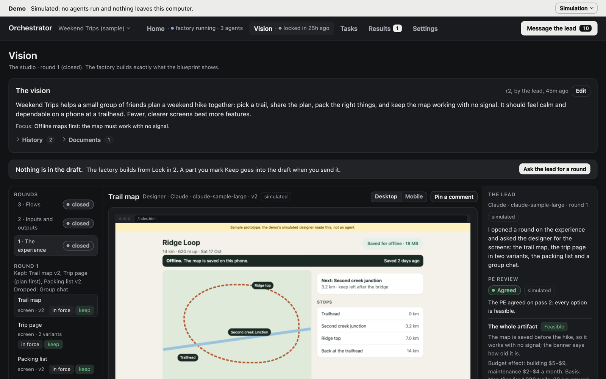

# Orchestrator


**One lead agent runs a team of Claude and Codex agents on your repository.** First you design the product with the lead, in Vision. Then you start the factory, and the lead builds what you approved, task by task. You answer the few decisions that need you, and you look at results: screens, recordings and test results, not code.

## Try the demo

The demo needs no API keys and runs no agents, and nothing leaves your computer:

```bash
git clone https://github.com/erickb336/orchestrator.git
cd orchestrator
npm install
npm start
```

It opens a sample project (Weekend Trips, a hiking app) on a simulated runtime, with a short tour. It needs Node.js 22.13 or newer.


## How it works

1. **Vision.** The lead opens rounds on one focus at a time: the experience, the inputs and outputs, or the flows. A designer makes screens you can click, terminal demos, data contracts and rules. The PE, a principal engineer agent, checks that each part can be built and estimates its cost. You keep, change or drop each part.
2. **Start the factory.** The pre-flight shows the blueprint (what you approved), the planned tasks, the two budgets and how the factory runs. Your agreement starts it.
3. **The factory.** The lead plans tasks from the blueprint and gives each a [flow](flows/README.md): Change, Bug fix, Feature, Design, Investigation or Goal. Each step is a fresh agent in its own git worktree. The service runs your checks in your project's own container, two agents review each change, and the coder repairs until all are clean.
4. **Design and reality.** Each part of the blueprint shows where it stands. The built screen or CLI sits beside its design, and each rule sits beside its test.
5. **Change orders.** Vision stays open. A new design goes into the draft, and **Lock in** shows what it changes before the lead updates the tasks.

You can message the lead, send a note to a running agent, pause a task, edit a step's output or rerun it. The [user guide](docs/user-guide.md) tells how.



*Vision: the designer's part, your marks under it, and the PE's review beside it.*

## Why I built it

I use several AI agents every day, and the bottleneck is no longer writing code: it is me. Orchestrator is my playground for ways to take myself out of the loop, so that I review designs and working results instead of diffs. I set the direction and made the calls. AI agents in Claude Code wrote the specs and the code. Each feature started as a versioned spec with options and trade-offs ([`docs/tasks/`](docs/tasks/)), and a separate agent reviewed each one. It is deliberately small, local and readable. Fork it and make it yours.

## Use it on your own repository

```bash
npm run setup   # asks once: real agents or the demo, and how Claude and Codex sign in
npm start
```

Claude signs in with an API key, cloud credentials or (opt-in) your own subscription token; Codex with your ChatGPT sign-in. Your keys stay in your Keychain or your environment. Details: [docs/real-agents.md](docs/real-agents.md).

## Safety in brief

- **Local only.** The service listens on 127.0.0.1, and every agent works in its own git worktree. Your branch changes only by a fast-forward of verified work or by a pull request.
- **Sandboxed.** Codex agents run in Codex's sandbox, and Claude agents have no shell. Your checks run with no network: in your project's own container when Docker is available, else in a sandbox on this computer.
- **Narrow GitHub use.** The app merges only the exact commit that was verified, and never force-pushes. Full notes: [docs/safety.md](docs/safety.md).

## Development

```bash
npm run dev        # service + UI at http://127.0.0.1:5317, restarting on change
npm run typecheck
npm test
npm run build
npm run test:integration   # the end-to-end scenario on simulated agents (CI runs it)
npm run test:real          # the same scenario with real Claude and Codex agents (your credentials)
npm run capture            # retake the README images from the demo (needs Chrome and ffmpeg)
```

**Where things are:**

- `src/domain/`: pure state and commands, no I/O.
- `server/`: the service, its store, the scheduler and the Claude and Codex adapters.
- `src/ui/`: the app, built from one component kit (open `#/kit` in the running app).
- `flows/` and `principles/`: the flows, and the principles agents get.

## Status

A personal tool under active development, built in milestones ORC-001 to ORC-033. Each milestone has a spec with the options, the decision and the evidence. [The milestones](docs/milestones.md) lists what each added and what survives. The core run, notes, review repair, the studio and the factory have run with real models; [the real-run records](docs/real-runs/README.md) say what each run showed and what has not run yet.

## License

MIT. See [LICENSE](LICENSE).
